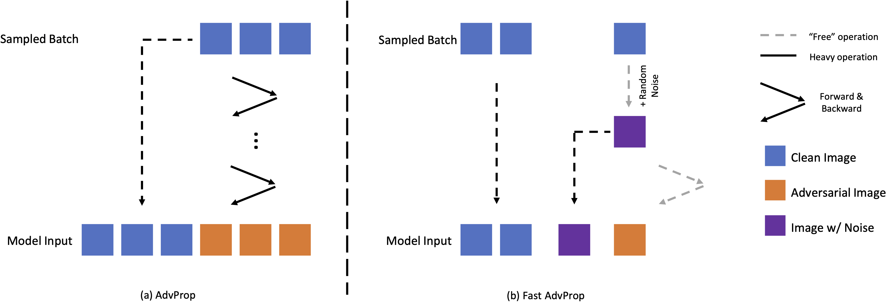

# Fast AdvProp

Implementation of ICLR 2022 Paper [Fast AdvProp](https://openreview.net/forum?id=hcoswsDHNAW).

## Introduction



Adversarial Propagation (AdvProp) is an effective way to improve recognition models, leveraging adversarial examples. Nonetheless, AdvProp suffers from the extremely slow training speed, mainly because: a) extra forward and backward passes are required for generating adversarial examples; b) both original samples and their adversarial counterparts are used for training (i.e., 2X data). In this paper, we introduce Fast AdvProp, which aggressively revamps AdvProp's costly training components, rendering the method nearly as cheap as the vanilla training. Specifically, our modifications in Fast AdvProp are guided by the hypothesis that disentangled learning with adversarial examples is the key for performance improvements, while other training recipes (e.g., paired clean and adversarial training samples, multi-step adversarial attackers) could be largely simplified.

Our empirical results show that, compared to the vanilla training baseline, Fast AdvProp is able to further model performance on a spectrum of visual benchmarks, without incurring extra training cost. Additionally, our ablations find Fast AdvProp scales better if larger models are used, is compatible with existing data augmentation methods (i.e., Mixup and CutMix), and can be easily adapted to other recognition tasks like object detection.

## Pretrained Models

Pretrained Models could be downloaded from [onedrive](https://1drv.ms/f/s!Alk-ml3frR0IzEmCGK_YS6vBozva).

## Environments

Install dependencies:

```bash
pip3 install -r requirements.txt
```

## Training Scripts

To train a ResNet-50 using Fast AdvProp,

```bash
bash scripts/run_fastadvprop.sh
```

## Acknowledgment

This repo is based on [tingxueronghua/pytorch-classification-advprop](https://github.com/tingxueronghua/pytorch-classification-advprop).
Thanks the contributors of these repos!

## Citation

If you use our code, models or wish to refer to our results, please use the following BibTex entry:

```bibtex
@inproceedings{mei2022fast_advprop,
    title     = {Fast AdvProp},
    author    = {Mei, Jieru and Han, Yucheng and Bai, Yutong and Zhang, Yixiao and Li, Yingwei and Li, Xianhang and Yuille, Alan and Xie, Cihang},
    booktitle = {International Conference on Learning Representations},
    year      = {2022},
}
```
